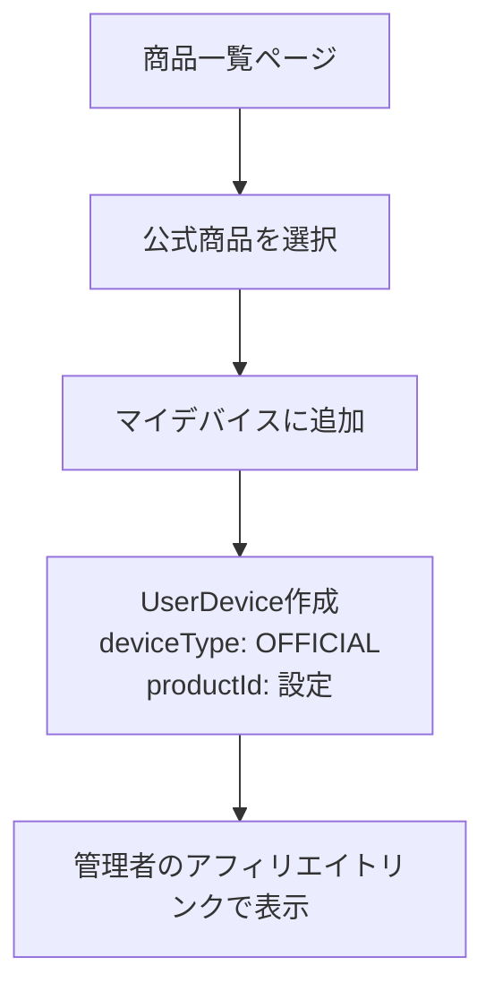
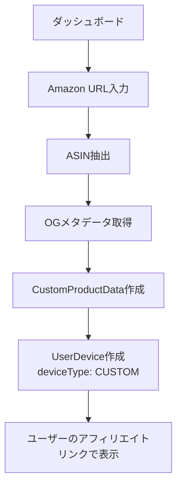
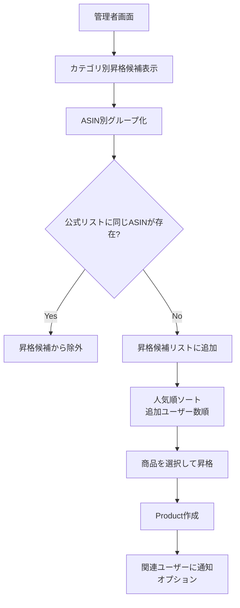

# デバイス管理システム設計書（最新版）

## 1. プロジェクト概要

**目的**: VTuber・配信者向けデバイス管理Webアプリケーション  
**ターゲット**: 配信者・VTuber・ゲーマー  
**コンセプト**:
- 使用デバイスをプロフィールに表示
- 商品比較・一覧ページ提供（未認証ユーザーにも公開）
- お気に入り機能
- コミュニティでの情報共有
- **アフィリエイト収益の適切な分配**（管理者・ユーザー双方）

## 2. 対象デバイスカテゴリ

**Phase 1（初期実装）**:
- マウス
- キーボード

**Phase 2（将来拡張）**:
- ヘッドセット・イヤホン
- マイク
- モニター
- キャプチャーボード
- Stream Deck等配信ツール
- チェア・デスク

## 3. 商品属性定義

### マウス属性
- DPI（数値範囲、例：400-25600）
- 重量（g）
- サイズ（幅×奥行×高さ mm）
- ポーリングレート（Hz：125/500/1000/8000）
- 接続方式（有線/無線/両対応）
- センサータイプ（光学/レーザー/PixArt PMW3389など）
- ボタン数（3-20個）
- プログラマブルボタン数
- オンボードメモリ（有無）
- ワイヤレス充電対応（有無）
- 形状（左右対称/右手用/左手用/エルゴノミクス）

### キーボード属性
- キーレイアウト（フルサイズ/テンキーレス/60%/65%/75%/80%）
- キー配列（日本語/英語/ISO）
- サイズ（幅×奥行×高さ mm）
- 重量（g）
- ポーリングレート（Hz）
- スイッチタイプ（メカニカル/磁気/光学/静電容量）
- キーストローク（mm）
- アクチュエーションポイント（mm）
- Rapid Trigger対応（有無）
- Rapid Trigger最小値（mm）
- 接続方式（有線/無線/両対応）

## 4. データベース設計（Prisma スキーマ）

```prisma
// === カテゴリ管理 ===
model Category {
  id          Int       @id @default(autoincrement())
  name        String    // "マウス", "キーボード"
  slug        String    @unique // "mouse", "keyboard"
  description String?
  createdAt   DateTime  @default(now()) @map("created_at")
  updatedAt   DateTime  @updatedAt @map("updated_at")
  
  // リレーション
  products    Product[]
  
  @@map("categories")
}

// === 管理者が厳選した公式商品リスト ===
model Product {
  id                   Int      @id @default(autoincrement())
  name                 String   // "Logicool G Pro X Superlight"
  description          String?
  categoryId           Int      @map("category_id")
  amazonUrl            String   @map("amazon_url")           // 元のAmazonURL
  adminAffiliateUrl    String   @map("admin_affiliate_url")  // 管理者のアソシエイトID付きURL
  asin                 String   @unique                      // 重複チェック用ASIN
  imageUrl             String   @map("image_url")
  price                Decimal? @db.Decimal(10, 2)           // 参考価格
  attributes           Json?                                  // カテゴリ別属性（JSON形式）
  isActive             Boolean  @default(true) @map("is_active") // 公開/非公開
  createdAt            DateTime @default(now()) @map("created_at")
  updatedAt            DateTime @updatedAt @map("updated_at")
  
  // リレーション
  category     Category       @relation(fields: [categoryId], references: [id])
  userDevices  UserDevice[]
  userFavorites UserFavorite[]
  
  @@map("products")
}

// === ユーザーの所持デバイス管理 ===
model UserDevice {
  id                  Int      @id @default(autoincrement())
  userId              String   @map("user_id")
  
  // 公式商品 OR カスタム商品のどちらか一方のみ設定
  productId           Int?     @map("product_id")           // 公式リストから選択した場合
  customProductData   Json?    @map("custom_product_data")  // ユーザー独自追加の場合
  
  deviceType          DeviceType @map("device_type")        // 'OFFICIAL' | 'CUSTOM'
  note                String?                               // ユーザーのメモ
  createdAt           DateTime @default(now()) @map("created_at")
  
  // リレーション
  user                User?    @relation(fields: [userId], references: [id], onDelete: Cascade)
  product             Product? @relation(fields: [productId], references: [id], onDelete: Cascade)
  
  @@map("user_devices")
}

// === お気に入り機能 ===
model UserFavorite {
  id        Int      @id @default(autoincrement())
  userId    String   @map("user_id")
  productId Int      @map("product_id")
  createdAt DateTime @default(now()) @map("created_at")
  
  // リレーション
  user      User?    @relation(fields: [userId], references: [id], onDelete: Cascade)
  product   Product  @relation(fields: [productId], references: [id], onDelete: Cascade)
  
  @@unique([userId, productId])
  @@map("user_favorites")
}

// === Enum定義 ===
enum DeviceType {
  OFFICIAL  // 公式リストから選択
  CUSTOM    // ユーザー独自追加
}

// === 既存のUserモデルに追加 ===
model User {
  // ... 既存のフィールド
  
  // デバイス管理用の追加フィールド
  amazonAssociateId String? @map("amazon_associate_id")  // ユーザーのアソシエイトID
  
  // リレーション
  userDevices   UserDevice[]
  userFavorites UserFavorite[]
}
```

### カスタム商品データ（JSON）の構造例

```typescript
interface CustomProductData {
  title: string;                    // "ASUS ROG Keris Wireless"
  description?: string;
  imageUrl: string;                 // OGメタデータから取得
  amazonUrl: string;                // 元のURL
  userAffiliateUrl?: string;        // ユーザーのアソシエイトID付きURL
  asin: string;                     // 重複チェック用
  category: string;                 // "mouse", "keyboard"
  attributes?: Record<string, any>; // {"dpi_max": 16000, "weight": 79, ...}
  addedByUserId: string;            // 追加したユーザーID
  potentialForPromotion: boolean;   // 昇格候補フラグ
  createdAt: string;                // ISO文字列
}
```

## 5. システムフロー設計

### A. 公式商品からの追加フロー



### B. ユーザー独自追加フロー



### C. 昇格機能フロー



## 6. 商品情報取得戦略

### 管理者・ユーザーの棲み分け方式

**管理者**: Amazon PA-API利用（厳選商品のみ）
- 公式商品リストの作成・更新にPA-API使用
- 週1回の定期価格・在庫状況更新
- 1秒1回制限内での安全な運用

**ユーザー**: OGメタデータ + 軽量スクレイピング方式
- PA-API規約違反リスク回避
- 即座に追加可能でUX向上
- ユーザー自身のアフィリエイト収益確保

### 管理者用PA-API実装

```typescript
// lib/amazon-pa-api.ts - 管理者専用
interface ProductAPIData {
  title: string;
  price?: number;
  imageUrl?: string;
  description?: string;
  availability?: string;
}

export async function fetchProductFromPAAPI(asin: string): Promise<ProductAPIData> {
  const params = {
    'Service': 'ProductAdvertisingAPI',
    'Operation': 'GetItems',
    'Resources': [
      'Images.Primary.Large',
      'ItemInfo.Title',
      'ItemInfo.Features',
      'Offers.Listings.Price',
      'Offers.Listings.Availability'
    ],
    'ItemIds': [asin],
    'PartnerTag': process.env.AMAZON_ASSOCIATE_ID,
    'PartnerType': 'Associates',
    'Marketplace': 'www.amazon.co.jp'
  };

  const signature = generateAWSSignature(params);
  
  const response = await fetch('https://webservices.amazon.co.jp/paapi5/getitems', {
    method: 'POST',
    headers: {
      'Content-Type': 'application/json; charset=utf-8',
      'X-Amz-Target': 'com.amazon.paapi5.v1.ProductAdvertisingAPIv1.GetItems',
      'Authorization': signature
    },
    body: JSON.stringify(params)
  });

  const data = await response.json();
  const item = data.ItemsResult?.Items?.[0];
  
  return {
    title: item?.ItemInfo?.Title?.DisplayValue || '',
    price: item?.Offers?.Listings?.[0]?.Price?.Amount,
    imageUrl: item?.Images?.Primary?.Large?.URL,
    description: item?.ItemInfo?.Features?.DisplayValues?.join(', '),
    availability: item?.Offers?.Listings?.[0]?.Availability?.Message
  };
}
```

### 定期更新バッチ処理

```typescript
// app/api/admin/batch-update-products/route.ts
export async function POST(request: Request) {
  const isAdmin = await verifyAdminAuth(request);
  if (!isAdmin) {
    return NextResponse.json({ error: 'Unauthorized' }, { status: 401 });
  }

  const products = await prisma.product.findMany({
    where: { isActive: true },
    select: { id: true, asin: true, name: true }
  });

  const updateResults = [];
  
  for (const product of products) {
    try {
      const apiData = await fetchProductFromPAAPI(product.asin);
      
      await prisma.product.update({
        where: { id: product.id },
        data: {
          price: apiData.price,
          imageUrl: apiData.imageUrl,
          description: apiData.description,
          updatedAt: new Date()
        }
      });
      
      updateResults.push({ id: product.id, status: 'success' });
      
      // PA-API制限対応（1秒1回）
      await new Promise(resolve => setTimeout(resolve, 1100));
      
    } catch (error) {
      updateResults.push({ id: product.id, status: 'error', error: error.message });
    }
  }

  return NextResponse.json({ results: updateResults });
}
```

### ユーザー用OGメタデータ取得

```typescript
// lib/og-metadata.ts - ユーザー用
interface OGProductInfo {
  title: string;
  description?: string;
  imageUrl: string;
  price?: string;
  asin: string;
}

export async function fetchProductFromAmazonUrl(url: string): Promise<OGProductInfo> {
  // 1. ASIN抽出
  const asin = extractASIN(url);
  
  // 2. OGメタデータ取得
  const ogData = await fetchOGMetadata(url);
  
  // 3. 軽量スクレイピング（価格等）
  const additionalData = await lightScraping(url);
  
  return {
    title: ogData.title || 'Amazon商品',
    description: ogData.description,
    imageUrl: ogData.image,
    price: additionalData.price,
    asin
  };
};
```

## 7. UI設計・UX方針

### 統一表示のためのデータ変換

```typescript
// 表示用の統一インターフェース
interface DisplayDevice {
  id: string;
  title: string;
  description?: string;
  imageUrl: string;
  affiliateUrl: string;    // 表示用リンク（管理者 or ユーザー）
  category: string;
  attributes: Record<string, any>;
  sourceType: 'official' | 'custom';  // バッジ表示用
  note?: string;
}

// 変換関数
const formatUserDevices = (userDevices: UserDevice[]): DisplayDevice[] => {
  return userDevices.map(device => {
    if (device.deviceType === 'OFFICIAL' && device.product) {
      return {
        id: `official-${device.id}`,
        title: device.product.name,
        description: device.product.description,
        imageUrl: device.product.imageUrl,
        affiliateUrl: device.product.adminAffiliateUrl,  // 管理者収益
        category: device.product.category.name,
        attributes: device.product.attributes as Record<string, any>,
        sourceType: 'official',
        note: device.note
      };
    } else {
      const customData = device.customProductData as CustomProductData;
      return {
        id: `custom-${device.id}`,
        title: customData.title,
        description: customData.description,
        imageUrl: customData.imageUrl,
        affiliateUrl: customData.userAffiliateUrl || customData.amazonUrl,  // ユーザー収益
        category: customData.category,
        attributes: customData.attributes || {},
        sourceType: 'custom',
        note: device.note
      };
    }
  });
};
```

### ページ構成

**商品一覧ページ（公開）**:
- 左サイドバー: カテゴリ選択（マウス・キーボード等）
- 上部フィルタ: カテゴリ特有のフィルタ（DPI範囲・レイアウト等）
- メインエリア: テーブル形式での商品比較表示
- 検索バー: キーワード検索
- 認証状態による表示切り替え:
  - 未認証: 閲覧のみ
  - 認証済み: 「マイデバイスに追加」「お気に入り」ボタン表示

**ユーザーダッシュボード（認証済み）**:
- デバイス管理タブ: 保有デバイス一覧・追加・編集
- お気に入りタブ: 気になる商品一覧
- 商品追加タブ: Amazon URL入力・カテゴリ選択

**管理者画面**:
- 商品管理: 公式商品の追加・編集・削除
- 昇格候補: ユーザー追加商品の確認・昇格処理
- カテゴリ管理: 新規カテゴリ追加

## 8. 実装優先度

**Phase 1**: データベース設計 + Prismaスキーマ実装
**Phase 2**: OGメタデータ取得サービス実装
**Phase 3**: 基本的なUserDevice CRUD機能
**Phase 4**: 公式商品管理（管理者機能）
**Phase 5**: Amazon URL追加機能（重複チェック含む）
**Phase 6**: 統一表示UI実装
**Phase 7**: 商品一覧ページ（公開版）
**Phase 8**: 昇格機能・管理者ダッシュボード
**Phase 9**: お気に入り機能
**Phase 10**: ユーザープロフィール表示

## 9. 重複チェック機能

### ASIN抽出・チェック
```typescript
// ASIN抽出関数
const extractASIN = (url: string): string | null => {
  const asinRegex = /\/(?:dp|gp\/product)\/([A-Z0-9]{10})/;
  const match = url.match(asinRegex);
  return match ? match[1] : null;
};

// 重複チェック関数（昇格機能用）
const checkDuplicateProduct = async (asin: string): Promise<Product | null> => {
  return await prisma.product.findUnique({
    where: { asin },
    include: { category: true }
  });
};
```

### ユーザー追加時の実装（重複チェックなし）
```typescript
// ユーザー独自追加フロー（自由追加）
const addCustomDevice = async (userId: string, amazonUrl: string, userAssociateId?: string) => {
  // 1. ASIN抽出
  const asin = extractASIN(amazonUrl);
  
  // 2. OGメタデータ取得
  const productData = await fetchProductFromAmazonUrl(amazonUrl);
  
  // 3. ユーザーのアフィリエイトURL生成
  const userAffiliateUrl = userAssociateId 
    ? addAssociateIdToUrl(amazonUrl, userAssociateId)
    : amazonUrl;
  
  // 4. UserDeviceに保存（重複に関係なく自由に追加）
  await prisma.userDevice.create({
    data: {
      userId: userId,
      productId: null,  // 公式商品ではない
      deviceType: 'CUSTOM',
      customProductData: {
        title: productData.title,
        description: productData.description,
        imageUrl: productData.imageUrl,
        amazonUrl: amazonUrl,
        userAffiliateUrl: userAffiliateUrl,
        asin: asin,
        category: await detectCategory(productData.title),
        attributes: await extractAttributes(productData),
        addedByUserId: userId,
        potentialForPromotion: false,
        createdAt: new Date().toISOString()
      }
    }
  });
};
```

### 昇格候補取得（公式商品と重複するASINを除外）
```typescript
const getPromotionCandidates = async (categoryId: number) => {
  // 1. ユーザーが追加したカスタム商品を取得
  const customDevices = await prisma.userDevice.findMany({
    where: {
      deviceType: 'CUSTOM',
      customProductData: {
        path: ['category'],
        equals: getCategorySlug(categoryId)
      }
    }
  });
  
  // 2. ASIN別にグループ化
  const asinGroups = new Map<string, any[]>();
  
  customDevices.forEach(device => {
    const customData = device.customProductData as CustomProductData;
    
    if (customData.asin) {
      if (!asinGroups.has(customData.asin)) {
        asinGroups.set(customData.asin, []);
      }
      asinGroups.get(customData.asin)!.push({
        ...device,
        customData
      });
    }
  });
  
  // 3. 既存の公式商品のASINを取得
  const officialASINs = await prisma.product.findMany({
    where: { categoryId: categoryId },
    select: { asin: true }
  }).then(products => 
    products.map(p => p.asin).filter(Boolean)
  );
  
  // 4. 公式商品と重複するASINを除外した昇格候補を返す
  const candidates = [];
  for (const [asin, devices] of asinGroups) {
    if (!officialASINs.includes(asin)) {
      // 公式リストにない商品のみ昇格候補に追加
      candidates.push({
        asin,
        title: devices[0].customData.title,
        imageUrl: devices[0].customData.imageUrl,
        userCount: devices.length,  // 何人が追加しているか
        devices
      });
    }
  }
  
  return candidates.sort((a, b) => b.userCount - a.userCount);  // 人気順ソート
};
```


## 10. セキュリティ・認証

- **商品一覧**: 未認証ユーザーも閲覧可能
- **デバイス管理**: 認証済みユーザーのみ
- **管理者機能**: 管理者権限必須
- **CSRF対策**: Next.jsの標準機能を利用
- **XSS対策**: OGメタデータのサニタイズ必須

## 11. パフォーマンス考慮事項

- **画像最適化**: Next.js Image コンポーネント活用
- **キャッシュ戦略**: OGメタデータの適切なキャッシュ
- **ページネーション**: 商品一覧の適切な分割
- **インデックス**: ASIN、category_id、user_id に適切なインデックス

## 13. 商品一括追加機能

### Prisma Seed機能（初期データ投入）

```typescript
// prisma/seed.ts
import { PrismaClient } from '@prisma/client';

const prisma = new PrismaClient();

async function main() {
  console.log('Start seeding...');

  // カテゴリー作成
  const mouseCategory = await prisma.category.upsert({
    where: { slug: 'mouse' },
    update: {},
    create: {
      name: 'マウス',
      slug: 'mouse',
      description: 'ゲーミングマウス・一般マウス'
    }
  });

  const keyboardCategory = await prisma.category.upsert({
    where: { slug: 'keyboard' },
    update: {},
    create: {
      name: 'キーボード',
      slug: 'keyboard',
      description: 'ゲーミングキーボード・一般キーボード'
    }
  });

  // 商品データ準備
  const productsData = [
    {
      name: 'Logicool G Pro X Superlight',
      categoryId: mouseCategory.id,
      amazonUrl: 'https://amazon.co.jp/dp/B08NWQ8JRF',
      asin: 'B08NWQ8JRF',
      adminAffiliateUrl: 'https://amazon.co.jp/dp/B08NWQ8JRF?tag=your-associate-id',
      imageUrl: 'https://m.media-amazon.com/images/I/...',
      price: 16280,
      attributes: {
        dpi_max: 25600,
        weight: 63,
        connection_type: 'wireless',
        sensor_type: 'HERO 25K',
        buttons: 5
      }
    },
    {
      name: 'Razer DeathAdder V3',
      categoryId: mouseCategory.id,
      amazonUrl: 'https://amazon.co.jp/dp/B0B87XXXXX',
      asin: 'B0B87XXXXX',
      adminAffiliateUrl: 'https://amazon.co.jp/dp/B0B87XXXXX?tag=your-associate-id',
      imageUrl: 'https://m.media-amazon.com/images/I/...',
      price: 8980,
      attributes: {
        dpi_max: 30000,
        weight: 59,
        connection_type: 'wired',
        sensor_type: 'Focus Pro 30K',
        buttons: 5
      }
    }
    // ... その他の商品データ
  ];

  // createManyで一括作成
  const result = await prisma.product.createMany({
    data: productsData,
    skipDuplicates: true  // 重複をスキップ
  });

  console.log(`Created ${result.count} products`);
  console.log('Seeding finished.');
}

main()
  .catch((e) => {
    console.error(e);
    process.exit(1);
  })
  .finally(async () => {
    await prisma.$disconnect();
  });
```

**package.json 設定**:
```json
{
  "prisma": {
    "seed": "tsx prisma/seed.ts"
  },
  "scripts": {
    "db:seed": "prisma db seed",
    "db:reset": "prisma migrate reset"
  }
}
```

**実行コマンド**:
```bash
# 初期データ投入
npm run db:seed

# DBリセット＆シード
npm run db:reset
```

### CSV一括インポート機能

```typescript
// app/api/admin/import-products/route.ts
import Papa from 'papaparse';
import { addAssociateIdToUrl } from '@/lib/amazon-utils';

export async function POST(request: Request) {
  const isAdmin = await verifyAdminAuth(request);
  if (!isAdmin) {
    return NextResponse.json({ error: 'Unauthorized' }, { status: 401 });
  }

  const formData = await request.formData();
  const file = formData.get('file') as File;
  
  if (!file) {
    return NextResponse.json({ error: 'No file uploaded' }, { status: 400 });
  }

  const csvText = await file.text();
  
  const { data, errors } = Papa.parse(csvText, {
    header: true,
    skipEmptyLines: true,
    dynamicTyping: true
  });

  if (errors.length > 0) {
    return NextResponse.json({ 
      error: 'CSV parse errors', 
      details: errors 
    }, { status: 400 });
  }

  // バリデーション
  const validProducts = data.filter(row => 
    row.name && row.asin && row.amazonUrl && row.categoryId
  );

  // 管理者アフィリエイトリンク付与
  const productsToCreate = validProducts.map(product => ({
    ...product,
    adminAffiliateUrl: addAssociateIdToUrl(
      product.amazonUrl, 
      process.env.ADMIN_AMAZON_ASSOCIATE_ID
    ),
    createdAt: new Date(),
    updatedAt: new Date()
  }));

  // 一括作成
  const result = await prisma.product.createMany({
    data: productsToCreate,
    skipDuplicates: true
  });

  return NextResponse.json({ 
    message: `${result.count} products imported successfully`,
    total: validProducts.length,
    skipped: validProducts.length - result.count
  });
}
```

**CSVフォーマット例**:
```csv
name,asin,amazonUrl,categoryId,price,attributes
"Logicool G Pro X Superlight","B08NWQ8JRF","https://amazon.co.jp/dp/B08NWQ8JRF",1,16280,"{""dpi_max"": 25600, ""weight"": 63}"
"Razer DeathAdder V3","B0B87XXXXX","https://amazon.co.jp/dp/B0B87XXXXX",1,8980,"{""dpi_max"": 30000, ""weight"": 59}"
```

## 14. 今後の拡張可能性

- **カテゴリ追加**: ヘッドセット、マイク等への対応
- **商品比較機能**: 複数商品の詳細比較

---
